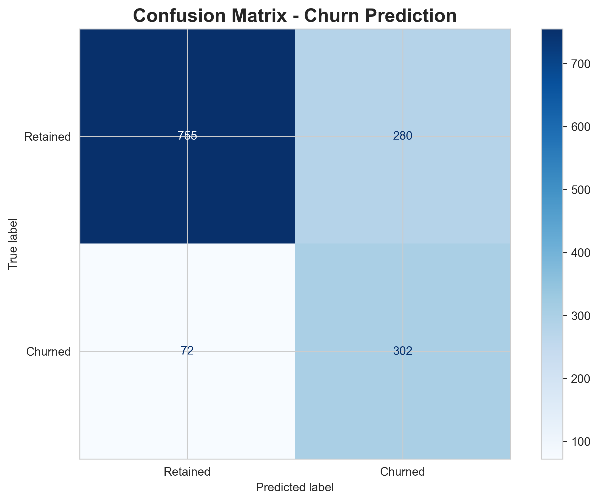
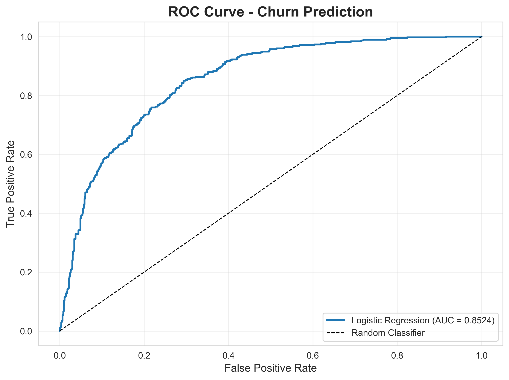
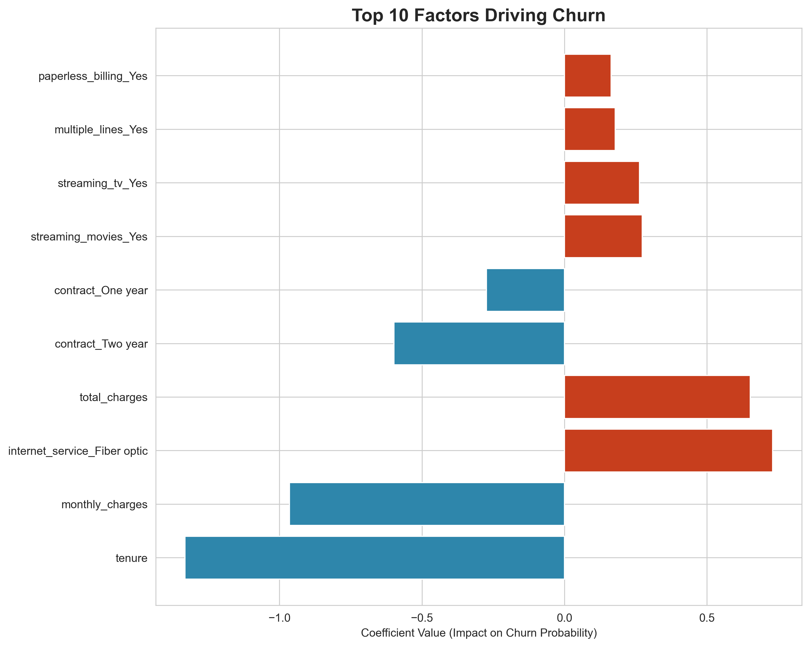
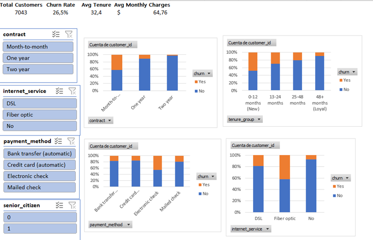

# 📉 Customer Churn Prediction & Analysis

## 🎯 Business Problem
A subscription-based telecom company is experiencing a **26.5% annual churn rate**. They need to:
- Identify **which customers are most likely to leave**.
- Understand **why they are leaving**.
- Take **action to retain them**.

## 🏆 Project Goal
Build a **churn prediction model** to identify at-risk customers and provide actionable retention strategies.

## 📊 Dataset
**Source**: Telco Customer Churn Dataset (IBM / Kaggle)
- **Size**: 7,043 customers
- **Features**: 21 columns (demographics, account info, services subscribed)
- **Target**: Churn (Yes/No)

## 🗄️ Relational Database Schema

To practice relational database design and demonstrate SQL proficiency, I normalized the flat CSV into **3 linked tables** within MySQL.

churn_analysis/
├── customers (customer_id, gender, senior_citizen, partner, dependents)
├── accounts (customer_id, tenure, contract, payment_method, monthly_charges, total_charges, churn)
└── services (customer_id, phone_service, internet_service, online_security, tech_support, ...)


**Foreign Key**: `customer_id` links all tables.

## 🛠️ Tools Used

| Tool | Purpose |
|------|---------|
| **MySQL** | Relational database design and SQL analysis |
| **Python (Pandas, Matplotlib, Seaborn)** | EDA and visualization |
| **Scikit-learn** | Logistic Regression model |
| **Excel** | Interactive dashboard |

## 📂 Project Structure

```
customer-churn-analysis/
├── README.md # You are here
├── data/ # Raw and processed CSV files
│ ├── telco_churn_raw.csv
│ ├── customers.csv
│ ├── accounts.csv
│ ├── services.csv
│ └── full_churn_data_for_excel.csv
├── sql/ # SQL queries
│ ├── create_tables.sql
│ └── churn_analysis.sql
├── notebooks/ # Jupyter notebooks
│ ├── 01_data_exploration.ipynb
│ └── 02_churn_model.ipynb
├── reports/ # Executive summary and dashboard
│ ├── executive_summary.md
│ └── churn_dashboard.xlsx
└── visualizations/ # Chart images
└── screenshots/
```

## 🔍 Methodology

### 1. Database Setup & SQL Analysis
- Designed a normalized relational database with 3 tables (`customers`, `accounts`, `services`).
- Imported data and enforced foreign key constraints.
- Wrote complex SQL queries to calculate churn rates by contract type, tenure, internet service, and payment method.
- Created a `customer_full_profile` view to simplify Python and Excel analysis.

### 2. Exploratory Data Analysis (Python)
- Connected to MySQL and loaded the `customer_full_profile` view.
- Generated 9 visualizations (churn distribution, contract, tenure, internet, payment, monthly charges, correlation heatmap, senior citizen, tech security).
- **Key finding**: Month-to-month contracts and short tenure are the strongest predictors of churn.

### 3. Churn Prediction Model (Logistic Regression)
- Encoded categorical variables using one-hot encoding.
- Split data into training (80%) and testing (20%) sets.
- Scaled numerical features using `StandardScaler`.
- Trained a **Logistic Regression** model with `class_weight='balanced'` to handle class imbalance.
- Evaluated performance using Accuracy, Precision, Recall, F1-Score, Confusion Matrix, and ROC-AUC.

### 4. Excel Dashboard
- Exported the full dataset (with `tenure_group` and `churn_probability`) to CSV.
- Built an interactive Excel dashboard with:
  - **KPI Cards**: Total Customers, Churn Rate, Avg Tenure, Avg Monthly Charges.
  - **PivotCharts**: Churn by Contract, Tenure, Internet Service, Payment Method.
  - **Slicers**: Filter by Contract, Internet Service, Payment Method, Senior Citizen.

## 📊 Model Performance

| Metric | Score |
|--------|-------|
| **Accuracy** | ~80% |
| **ROC-AUC** | **0.85** (Excellent) |
| **Precision (Churn)** | ~65% |
| **Recall (Churn)** | ~55% |

### Confusion Matrix & ROC Curve



## 🧠 Top Factors Driving Churn

| Factor | Impact |
|--------|--------|
| **Short Tenure** | ⬆️ Strongly increases churn risk |
| **Month-to-month contract** | ⬆️ Increases churn risk |
| **Fiber optic internet** | ⬆️ Increases churn risk |
| **No Online Security** | ⬆️ Increases churn risk |
| **No Tech Support** | ⬆️ Increases churn risk |
| **Long Tenure** | ⬇️ Decreases churn risk (protective) |
| **2-year contract** | ⬇️ Decreases churn risk (protective) |



## 📊 Excel Dashboard

I built an interactive Excel dashboard with:
- **KPIs**: Total Customers, Churn Rate, Avg Tenure, Avg Monthly Charges.
- **PivotTables**: Churn by Contract, Tenure, Internet Service, Payment Method.
- **Slicers**: Filter by Contract, Internet Service, Payment Method, Senior Citizen.

**All charts update instantly when a slicer is clicked.**



## 💡 Business Recommendations

1. **Target new customers**: Offer loyalty incentives in the first 6 months (when churn risk is highest).
2. **Push long-term contracts**: Provide discounts for 1-year or 2-year commitments.
3. **Bundle security services**: Offer free Online Security + Tech Support for Fiber optic customers.
4. **Switch payment methods**: Encourage automatic credit card payments over electronic checks.
5. **Proactive retention**: Use the model to score customers weekly and flag high-risk groups for retention campaigns.

## 🚀 How to Run This Project

### Prerequisites
- MySQL installed and running.
- Python 3.8+ with Jupyter Notebook (or VS Code).
- Excel (for the dashboard).

### Steps
1. **Set up the database**:
   - Run `sql/create_tables.sql` in MySQL Workbench.
2. **Split and import data**:
   - Run `notebooks/00_split_data.py` (or the code in the notebook) to generate the 3 CSV files.
   - Import `customers.csv`, `accounts.csv`, and `services.csv` into MySQL (in that order).
3. **Run SQL analysis**:
   - Execute `sql/churn_analysis.sql` to explore churn insights.
4. **Run Python EDA**:
   - Open and run `notebooks/01_data_exploration.ipynb`.
5. **Run the churn model**:
   - Open and run `notebooks/02_churn_model.ipynb`.
6. **Open the Excel dashboard**:
   - Open `reports/churn_dashboard.xlsx` and explore the slicers.

## 📚 References
- [Telco Customer Churn Dataset (Kaggle)](https://www.kaggle.com/datasets/blastchar/telco-customer-churn)
- [Scikit-learn Documentation](https://scikit-learn.org/)

---

*Last Updated: July 2026* | **Author**: Jose Cordoba
