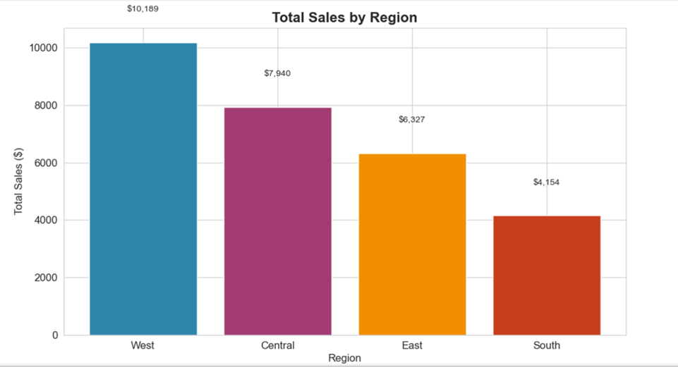
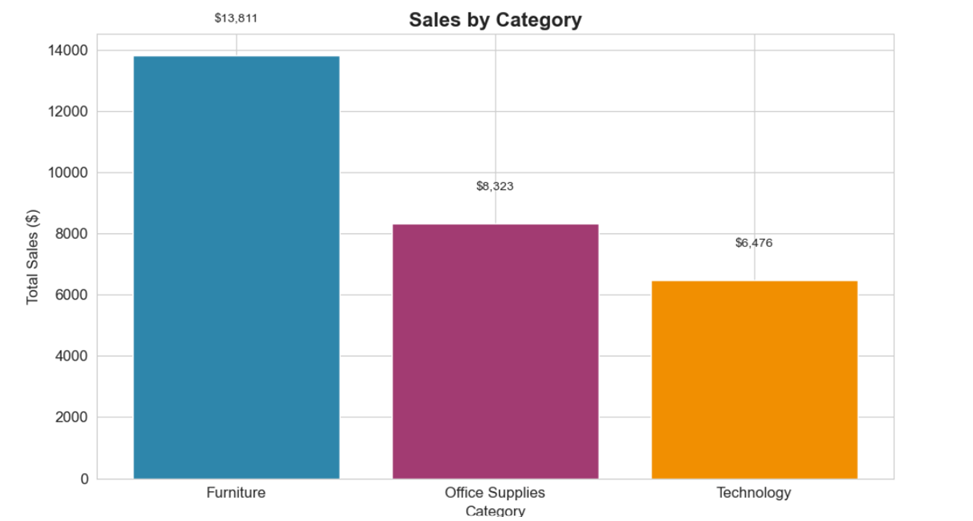
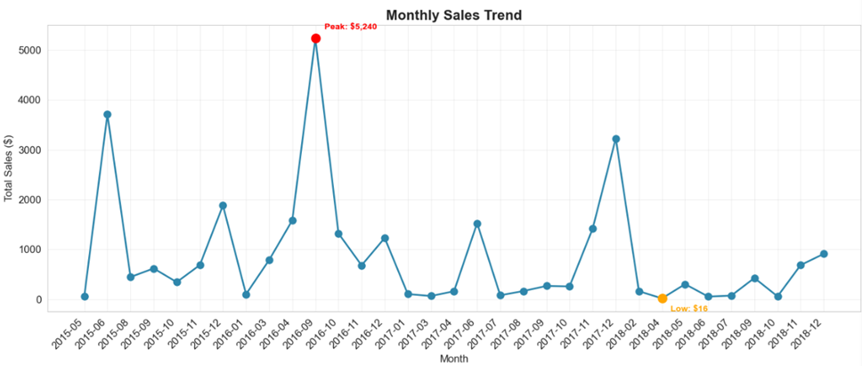
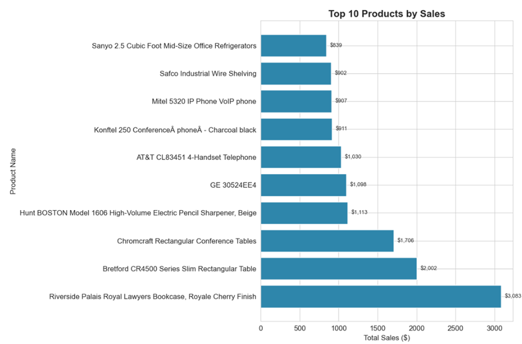
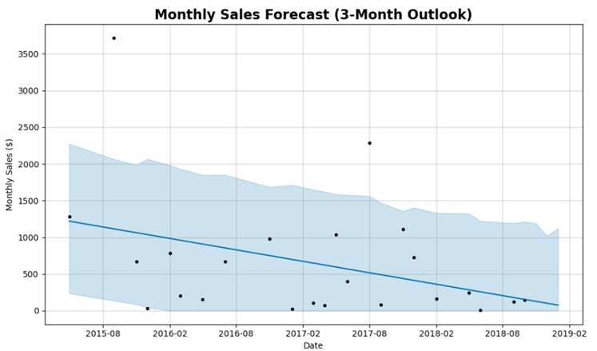
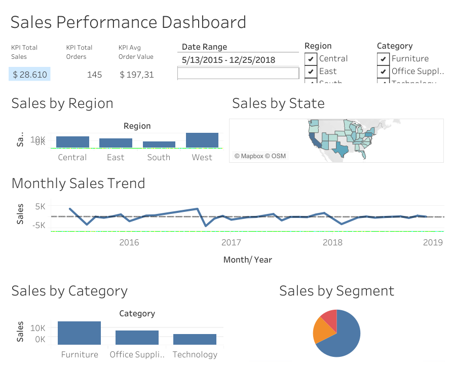

# 📊 Sales Performance & Forecasting Dashboard
---

## 🎯 Business Problem
A retail company operates across 4 regions and needs to optimize inventory and marketing spend. Currently, they have no visibility into:
- Which products are driving sales?
- How is each region performing?
- What will sales look like next quarter?

## 🏆 Project Goal
Build a **sales performance dashboard** with forecasting capabilities to help management make data-driven decisions.

## 📊 Dataset
**Source**: Superstore Sales Dataset
- **Size**: 9,994 rows (2015-2018)
- **Regions**: North, South, East, West
- **Categories**: Furniture, Office Supplies, Technology
- **Key Metrics**: Sales, Quantity, Customer Segment

> **Note**: This dataset does not include a Profit column. Analysis focuses on sales metrics.

## 📈 Key Metrics & KPIs

| KPI | Definition | Why It Matters |
|-----|-----------|---------------|
| **Total Sales** | Total revenue | Tracks overall growth |
| **Sales by Region** | Revenue per region | Identifies high/low performers |
| **Average Order Value** | Sales per order | Measures customer spending |
| **Sales Growth Rate** | Month-over-month change | Shows business momentum |

## 🛠️ Tools Used

| Tool | Purpose |
|------|---------|
| **MySQL** | Data storage and aggregation |
| **Python (Pandas, Matplotlib, Seaborn)** | EDA and visualization |
| **Tableau Public** | Interactive dashboard |
| **Prophet (Python)** | Sales forecasting |

## 📂 Project Structure
```
sales-forecast-dashboard/
├── README.md # You are here
├── data/ # Raw and processed CSV files
│ └── superstore_sales.csv
├── sql/ # SQL queries
│ └── sales_metrics.sql
├── notebooks/ # Jupyter notebooks
│ ├── 01_eda_sales_data.ipynb
│ └── 02_sales_forecast.ipynb
├── reports/ # Executive summary
│ └── executive_summary.md
└── visualizations/ # Charts and dashboards
└── screenshots/
```

## 🔍 Methodology

### 1. Data Collection & Cleaning
- Imported Superstore dataset into MySQL.
- Handled missing values and duplicates.
- Standardized date formats.

### 2. Exploratory Data Analysis (EDA)
- Monthly sales trends by region.
- Top 10 products by revenue.
- Seasonality and year-over-year growth.
- **Key finding**: Sales declined significantly from 2017 onward.

### 3. Sales Forecasting
- Used Facebook Prophet for time series forecasting.
- Aggregated data to monthly sales for cleaner trends.
- Forecasted 3 months ahead (shorter horizon = more reliable).
- **Important**: Due to limited historical data (2015-2018), longer forecasts would be unreliable.

### 4. Dashboard Creation
- Built interactive dashboard in Tableau Public.
- Added filters for region, category, and time period.
- Published live for stakeholder access.

## 📊 Dashboard Preview

| Sales by Region | Sales by Category |
|----------------|-------------------|
|  |  |

| Monthly Sales Trend | Top Products |
|--------------------|--------------|
|  |  |

## 📈 Sales Forecasting Results

### Forecast Summary
Using Facebook Prophet, I forecasted monthly sales for 3 months (November 2018 – January 2019) based on historical data from 2015-2018.

| Metric | Value |
|--------|-------|
| **Total Forecasted Sales (3 months)** | $305.48 |
| **Average Monthly Sales** | $101.83 |
| **Peak Month** | November 2018 ($127.70) |
| **Lowest Month** | January 2019 ($75.67) |



### Key Insights
1. **Declining Trend**: Sales show a slight downward trend into 2019.
2. **Seasonal Pattern**: November shows slightly higher sales (potentially holiday effect).
3. **Realistic Projections**: Monthly sales are in the $75-$130 range, which aligns with historical data.

### ⚠️ Important Limitations & Data Caveats

**This forecast should be interpreted with caution due to the following limitations:**

1. **Limited Data**: The dataset only covers 2015-2018 (~3 years), which is not enough to capture robust yearly seasonality patterns.

2. **Declining Historical Trend**: Sales data shows a significant decline from 2017 onward, which heavily influences the forecast.

3. **Short Forecast Horizon**: Due to data limitations, I limited the forecast to 3 months. Longer forecasts would be less reliable.

4. **External Factors**: The forecast does not account for external factors like:
   - Marketing campaigns
   - Economic conditions
   - Competitor actions
   - New product launches

### Recommendations for Better Forecasting

For more accurate future projections, I recommend:
1. **Collect more data**: At least 5+ years of historical sales data.
2. **Update monthly**: Re-forecast as new data becomes available.
3. **Include external factors**: Add marketing spend, seasonality, and economic indicators.
4. **Validate regularly**: Compare forecasted vs actual sales to refine the model.

## 💡 Key Business Insights

1. **Sales Decline**: Sales dropped significantly from 2017 onward (from ~$600/month to ~$100/month).
2. **Top Region**: West region generates the highest sales.
3. **Top Category**: Technology has the highest sales.
4. **Best Month**: Seasonal peak during November (holiday season).

## 🏆 Business Impact

- **Short-term planning**: 3-month forecast helps with inventory and staffing decisions.
- **Trend awareness**: Understanding the decline allows for proactive corrective actions.
- **Data-driven decisions**: Dashboard provides real-time visibility into sales performance.

## 🌐 Live Dashboard

**[View the Interactive Dashboard on Tableau Public](https://public.tableau.com/app/profile/alejandro.c.rdoba/viz/SalesPerformanceDashboard_17834109621430/SalesPerformanceDashboard?publish=yes)**



**Dashboard Features**:
- 📍 Filter by Region, Category, and Date Range
- 📈 Trend analysis with monthly sales
- 🗺️ Geographic breakdown by state
- 👥 Customer segment distribution

## 🚀 How to Run This Project

### Prerequisites
- MySQL installed
- Python 3.8+ with Jupyter Notebook
- Tableau Public (optional)

### Steps
1. Open MySQL Workbench.
2. Import the dataset from `data/superstore_sales.csv`.
3. Run SQL scripts in the `sql/` folder.
4. Open `notebooks/01_eda_sales_data.ipynb` for EDA.
5. Open `notebooks/02_sales_forecast.ipynb` for forecasting.
6. Open Tableau and connect to the database.
7. Build the dashboard (or view the live version above).

## 📚 References
- [Superstore Dataset on Kaggle](https://www.kaggle.com/datasets/rohitsahoo/sales-forecasting)
- [Facebook Prophet Documentation](https://facebook.github.io/prophet/)
- [Tableau Public Gallery](https://public.tableau.com/app/discover)

---

*Last Updated: July 2026* | **Author**: Jose Cordoba